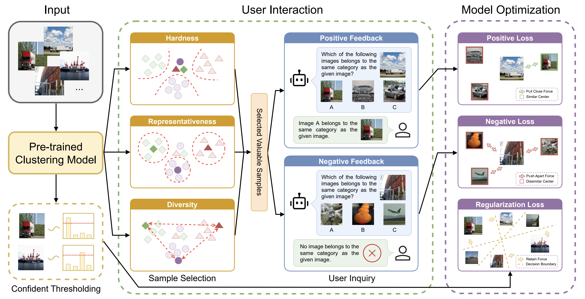

# 2024-NeurIPS-IDC
Code for the paper "Interactive Deep Clustering via Value Mining" (NeurIPS 2024)

# Usage

## Configuration

There is a configuration file "config/config.yaml", where one can edit.

## Dataset

CIFAR-10, CIFAR-100, and STL-10 will be automatically downloaded by Pytorch. For ImageNet-10 and ImageNet-dogs, we provide their description in the "datasets" folder.

## Pre-trained Model

We provide the checkpoints of [TCL](https://github.com/Yunfan-Li/Twin-Contrastive-Learning) on [TCL_checkpoints](https://drive.google.com/drive/folders/1quAGWPvJ3OQ-BM635yYPxF0tEig2nnO5?usp=sharing).

## Selecting Hard Samples

> python sample_selection.py

## Finetuning Pre-trained Model

> python fine-tune.py

## Testing

> python cluster.py

Please consider citing this paper if you find our work useful in your research, thanks.

